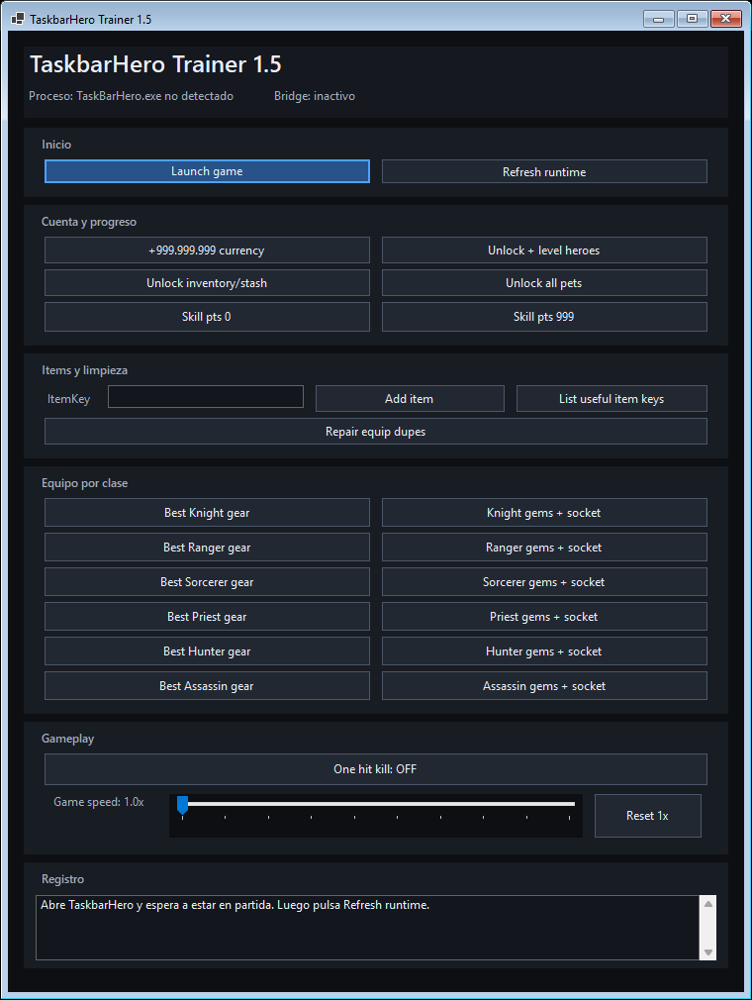

# TaskbarHero Trainer

Trainer externo para **TaskbarHero** con bridge BepInEx IL2CPP. No usa hotkeys:
todo se activa desde la ventana del trainer.



## Version actual

**TaskbarHero Trainer 1.5**

Descarga recomendada:

- [TaskbarHeroTrainer-v1.5.zip](https://github.com/elxokker/taskbarhero-trainer/releases/latest)

## Que incluye

- Launcher del juego con bridge activado.
- `Refresh runtime` para reconectar con el juego.
- `+999.999.999 currency`, suma monedas al valor actual.
- Desbloqueo y nivel de heroes.
- Desbloqueo de inventario/alijo.
- Desbloqueo de mascotas.
- Ajuste de puntos de habilidad a `0` o `999`.
- `One hit kill`.
- `Game speed` dentro de `Gameplay`, persistente aunque el cambio de stage intente volver a `1.0x`.
- Creacion de mejor equipo por clase.
- Gemas + socket por clase sobre equipo equipado.
- Reparacion de duplicados de equipo equipado.

## Instalacion rapida

1. Cierra TaskbarHero.
2. Descarga el ZIP de la ultima release.
3. Extraelo en cualquier carpeta.
4. Ejecuta PowerShell en esa carpeta:

```powershell
powershell -ExecutionPolicy Bypass -File .\install_taskbarhero_trainer.ps1
```

El instalador copia BepInEx IL2CPP, el bridge y el trainer. Tambien deja
Doorstop desactivado por defecto para que abrir el juego normal desde Steam no
cargue el trainer.

## Uso normal

Abre `TaskbarHeroTrainer.exe` y pulsa `Launch game`. Ese boton activa el bridge
solo para ese arranque, abre el juego desde Steam y vuelve a dejar Doorstop
apagado despues.

## Actualizar desde una version vieja

1. Cierra TaskbarHero y el trainer.
2. Descarga el ZIP nuevo.
3. Extraelo en una carpeta limpia.
4. Ejecuta otra vez:

```powershell
powershell -ExecutionPolicy Bypass -File .\install_taskbarhero_trainer.ps1
```

El instalador crea backup de los archivos sustituidos en la carpeta del juego.

## Estructura

- `src/trainer`: aplicacion WinForms externa.
- `src/bridge`: plugin BepInEx IL2CPP que ejecuta las acciones dentro del juego.
- `install_taskbarhero_trainer.ps1`: instalador para usuarios.
- `package_taskbarhero_release.ps1`: empaquetador de release.
- `INSTALL.md`: guia de uso incluida dentro del ZIP.

## Compilar

Requisitos de compilacion:

- .NET SDK 8.
- TaskbarHero instalado desde Steam.
- BepInEx 6 IL2CPP x64 instalado en la carpeta del juego.
- Interop generado por BepInEx al menos una vez.

Compilar trainer:

```powershell
dotnet build .\src\trainer\TaskbarHeroTrainer.csproj -c Release
```

Compilar bridge:

```powershell
dotnet build .\src\bridge\TaskbarHeroModMenu.csproj -c Release -p:GameDir="C:\Program Files (x86)\Steam\steamapps\common\TaskbarHero"
```
